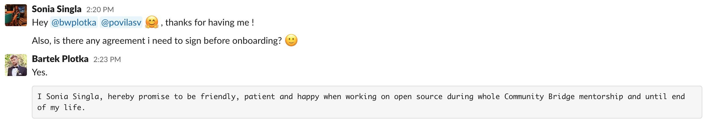

###Every person has their own journey, this is mine👩🏻‍💻

##Introduction:

Hello everyone, my name is Sonia 👱‍♀️,and currently, am pursuing my Bachelor’s in Information Technology from Panjab University, Chandigarh, India. I have been selected as an intern at [Cloud Native Computing Foundation](https://www.cncf.io/) with [Thanos](https://people.communitybridge.org/project/f51284ab-f652-47b1-9819-cd4135e75c00) where I will be working with the Project [Complete Katacoda tutorials](https://github.com/thanos-io/thanos/issues/2041) under the guidance of [Bartek Plotka](https://www.bwplotka.dev/) and [Povilas Versockas](https://povilasv.me/).

I would like to thanks my mentors, maintainers and the whole community for giving me this wonderful opportunity. I am really excited to dive deep into the project’s code base and to learn as much as I can despite all the hurdles that are waiting for me in the way ahead ☠️

##Project Description:

Ready to roll with me? 😉 To make sure, we are all on the same page, I’ll start with the Introduction of [Thanos](https://github.com/thanos-io/thanos), proceeding with [Katacoda](https://www.katacoda.com/) and the project on which i’ll be hacking this summer 🧐

##Thanos:Introduction

[Thanos, Promotheus, Grafana]
 

[Thanos](https://github.com/thanos-io/thanos) is a project that turns your [Prometheus](https://prometheus.io/docs/prometheus/latest/installation/) installation into a highly available metric system with unlimited storage capacity. From a very high-level view, it does this by deploying a sidecar to Prometheus, which uploads the data blocks to any object storage. A store component downloads the blocks again and makes them accessible to a query component, which has the same API as Prometheus itself. This works nicely with [Grafana](https://grafana.com/) because its the same API. So without much effort, you can view your nice dashboard graphs beyond the configured retention time of your Prometheus monitoring stack. and get an almost unlimited timeline , only restricted by object storage capacities. [Thanos](https://github.com/thanos-io/thanos) also provides downsampling of stored metrics, deduplication of data points and some more.

##Katacoda:Introduction

Katacoda 😻
 

Katacoda is an interactive Learning and Training Platform for Software Engineers, helping Developers Learn and Companies Increase Adoption. It provides isolation for each person, so they can explore and push the limits of their learning skills without worry about breaking the environment for other persons. Katacoda enhances your technical sales, training and internal education process.

Interesting, right? 😻

As part of this internship, I’ll be working on completing the Katacoda tutorials :

1. <i>Intro: Downsampling and unlimited metric retention for Prometheus.</i>
2. <i>Intro: Global and meta alerts with Thanos.</i>
3. <i>Advanced: Connecting remote Prometheuses to Thanos using simple Envoy setup.</i>
4. <i>Advanced: Using Prometheus remote write to stream metrics to Thanos.</i>
5. <i>Advanced: Query low tail latency with low cost: Introducing caching to Thanos.</i>

##Agreement:

Signed xDDDD
 

**Signing off for today, until next time 👻**

**:wq**