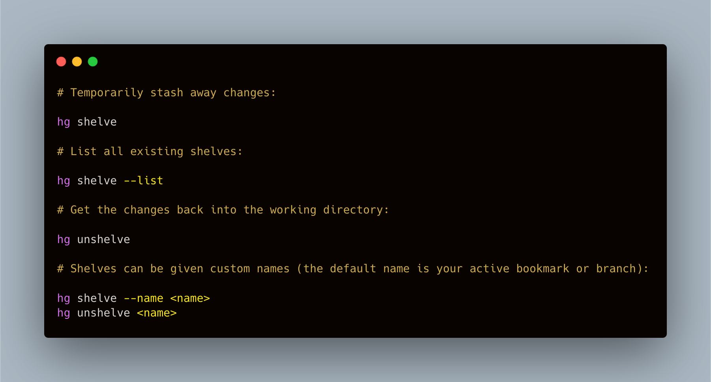
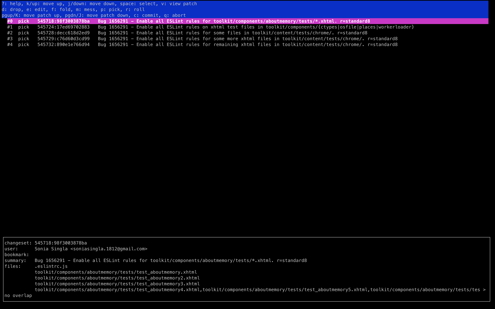

<center><sub>Mercurial Distributed SCM</sub></center><br/>


To collaborate with the other developers on a project around the world, all the programmers need some kind of `Version Control System (VCS)` to manage the source code. 

While most of the developers use git for a version control system, Mozilla uses `Mercurial` to manage the Firefox source code, and also, several other projects of Mozilla reside on GitHub in a git repository.


<center><sub>Annoying and Funny 👩🏻‍💻</sub></center><br/>

Figuring out how to fix the problems in `Mercurial` is near to impossible. Yes, you heard me right, and it's very easy to screw up. Mercurial documentation has this chicken and egg problem where you can't search for how to get yourself out of a mess unless you already know the name of the thing you need to know about to fix your problem.

Here, are some of the `Mercurial` commands with the focus on Firefox development to help you get started:

##1. hg commit

This command is used to create a commit along with the message, and commit all changes into a new changeset.

This command has the same format as that of git.


<center><sub></sub></center>

***Note: A changeset in Mercurial is a collection of changes to files in the code base, and it is identified using a changeset ID.***

##2. hg diff

This command is used to see all the changes we have made to different files/directories in the code base comparing against the parent directory. It displays all the uncommitted changes made along with the file names.

The output of `hg diff` will look similar to the snippet below:


<center><sub></sub></center>

##3. hg shelve

The shelve extension provides the shelve command to enable uncommitted work to be saved to a standalone file without being committed to the repository. It has been quite useful whenever there's a need to switch tasks, but not ready to commit the current work we have done.

We can enable the extension by adding the following lines to our `~/.hgrc` or `Mercurial.ini` file:

```bash
[extensions]
shelve=
```

The usage of this extension has been provided in the snippet below:


<center><sub></sub></center>

##4. hg strip

The strip extension provides the strip command to remove the changeset and all its descendants  from the repository completely.  It will be as if the changes never existed.  Be careful when using this on public changesets.

We can enable the extension by adding the following lines to our `~/.hgrc` or `Mercurial.ini` file:

```bash
[extensions]
strip =
```

To remove a changeset and its descendants from the repository:


<center><sub></sub></center>

***Note: If you want to read more about extensions, you can visit [here](https://mozilla-version-control-tools.readthedocs.io/en/latest/hgmozilla/extensions.html).***

##5. hg histedit

The histedit extension provides the histedit command to selecting (**pick**), combining (**fold** or **roll**), rejecting (**drop**), modifying (**edit**), or updating the commit message (**mess**) of already committed changesets.

We can enable the extension by adding the following lines to our `~/.hgrc` or `Mercurial.ini` file:

```bash
[extensions]
histedit =
```

If we run hg histedit , an editor will open that will look like the snapshot below:<br>


<center><sub></sub></center>

**Note: If you want to know about histedit extension in more detail, visit [here](https://docs.rhodecode.com/RhodeCode-Enterprise/tutorials/squash-commits.html).**

##6. hg bookmark

Bookmarks are labels on changesets to help track lines of development. Bookmarks are unversioned and can be moved, renamed, and deleted. Deleting or moving a bookmark does not effect on the associated changesets. They work similarly to the git notion of branches, closet not the same.


<center><sub></sub></center>

##7. hg amend

This command is  used to amend the parent of a working directory with a new commit that contains the changes in the parent in addition to those currently reported by `hg status` if there are any. 

Let me explain the above scenario in simple words: For instance, consider we made a commit, and forgot to modify some lines of code, made a typo in the commit message, or anything else, we can fix that by running the command as shown in the snippet below:


<center><sub></sub></center>

##8. hg log

This command lists all changes committed to a repository, starting with the most recent commit we made. The listing for each changeset includes the **changeset's revision number** and **identifier**, it's **tags**, **bookmarks**, **the changeset's author**, when it was created and summary as shown in the snippet below:


<center><sub></sub></center>

##9. hg pull && hg update --clean

This command is used to pull the latest changes (commits landed on ***Mozilla Central*** between the time when you last updated your local code base and now) and update the working copy of the codebase. Here, `hg pull` pulls all the changes but doesn't automatically update your working directory with the changes, so we use `hg update --clean` for that purpose.


<center><sub></sub></center>

##10. hg rebase

This command has many use cases, and rebase allows moving changesets between **branches**, **reordering changesets**, or maybe **collapsing changesets**.

The different use cases have been depicted in the snippet below:


<center><sub></sub></center>

Here, `-s`  flag depicts the **source changesetID**, `-d` flag tells the **destination changesetID**. We can use Mercurial tags like `central`, `tip`, etc. in place of **changesetID** as shown in the snippet above.

##11. hg wip

This command gives us a tree view on the ***heads/features***, and tracks down all the relevant changesets we have created while working on multiple bugs. I'll highly recommend you to read hg wip command described by [Customizing Mercurial Like a Pro](http://jordi.inversethought.com/blog/customising-mercurial-like-a-pro/). It has so much information packed into such a small space, all color-coded for our convenience.

The output of `hg wip` should look similar to the snippet below:


<center><sub></sub></center><br><br>

The above mercurial commands are more than enough to know and get the work started.

Contribute more, and more to the [Firefox](https://codetribute.mozilla.org/) projects, if you need help with anything or messed up, feel free to drop me a message or on the [Introduction](https://matrix.to/#/!ykhjAGdElNmYcYkwvB:mozilla.org?via=mozilla.org&via=matrix.org&via=privacytools.io) channel. 

If I missed an important detail or you wish to add anything to this blog post, please feel free to ping me. I look forward to hearing feedback. That's how we learn 🤗

Happy Mercurial !! 😻