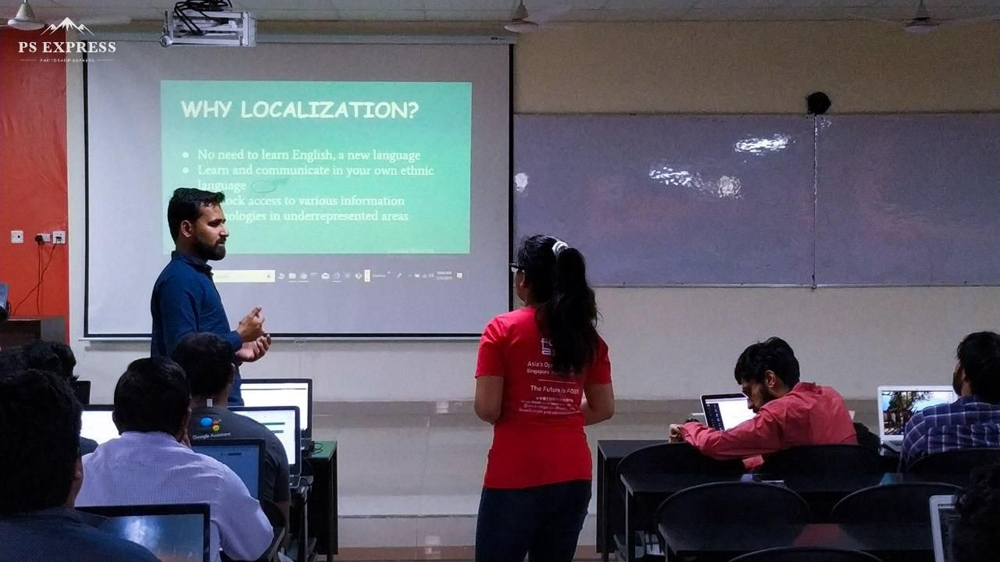

Presenting talk on localization
 

Few days ago, I got an opportunity to speak about `Localization with Pontoon` at the event `Dive into Open-Source` at **Jalandhar, India.**

Honored and excited to promote women in tech, I started thinking about what I could share. I wrote some notes on my non-technical journey into tech and how I get involved with [l10n](https://l10n.mozilla.org/) team at [Mozilla](https://www.mozilla.org/en-US/). Then, I started to think about how I could end my talk with specific guidance and a call to action for girls to contribute towards open-source.

I had talk with many attendees there. A common misconception, prevailed in almost of all the attendees that open-source is only about writing and testing code, fixing bugs. So that’s how I started with my talk 😉

I made the students familiar with the terms localization, it’s importance and what are the tools used for localization in the Mozilla Community. I took hands-on session of about one hour where the students from different teams `(Bengali, Hindi, Punjabi, Urdu etc.)` made at least minimum one contribution.

Coming up with importance, people who want to use the computer and advanced technologies must first learn English. In the area, with low literacy rates, this blocks access to information and communication technologies, especially for the rural poor and women who do not have equal access to education.

It helps the students to communicate in their own language. No need for local users to learn English first. The local programmers can gain expertise and experience expeditiously.

So, localization is top-priority contribution and an essential component in ensuring that our translation has the maximum effect on million of users.

A huge shout out to [l10n Mozilla Community](https://l10n.mozilla.org/) and [Peiying Mo](https://pbase.com/faerie_39/) for helping us with the event by providing such cool swags and much more ❤

If you need any help or want to ask any question, shoot mail at soniasingla.1812@gmail.com or [twitter](https://twitter.com/soniasinglas)