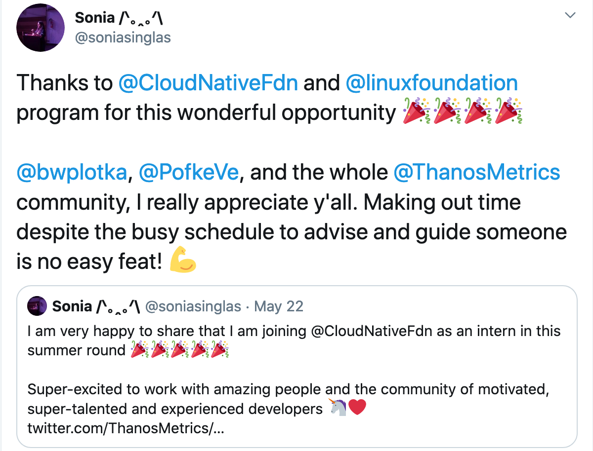
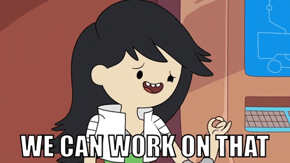
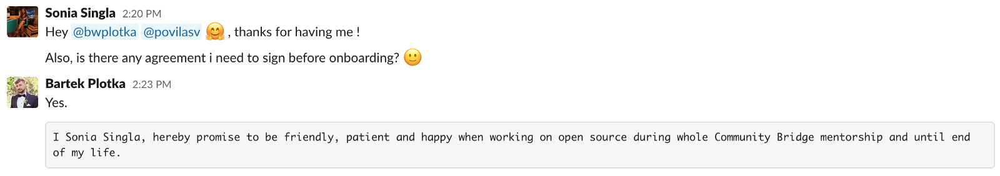

CNCF 😻
 

Hello everyone, my name is Sonia 👱‍♀️, and currently, am pursuing my Bachelor's in Information Technology from Panjab University, Chandigarh, India. I have successfully graduated from Linux Foundation's [Community Bridge program](https://communitybridge.org/) with [Thanos](https://thanos.io/) community. In this blog post, I am going to write about my experience and suggestions for future Community Bridge interns to help you get the most out of your internship 😻

###Every person has their own journey, this is mine👩🏻‍💻

##Application Process:

1. [Start Early 🕓](#1-start-early)
2. [Project Selection 🤔](#2-project-selection)
3. [Set Goals/Objectives 🎯](#3-set-goals)
4. [Community Engagement 🤝](#4-community-engagement)
5. [Ask for feedback 🙌🏻](#5-ask-for-feedback)

Applying for the [Community Bridge program](https://communitybridge.org/) is a very engaging process. It requires you to make many decisions and to commit the effort of making contributions as part of the requirements to be accepted.

<b>1. Start Early 🕓:</b> It is advisable to start the process early so that you can interact with the project mentors, maintainers, and the other community members. This ensures the understanding of the working style of the organization and adapts to it in a better manner when the internship period actually starts.  
If the mentors get to know you early and longer, then their decisions to choose you will be more informed than if you come in days before the deadline.

<b>2. Project Selection 🤔:</b> [Community Bridge program](https://communitybridge.org/) has a list of different organizations and most of them have interesting projects you would love to work on. Always try to focus on 2–3 projects rather than everywhere. Choose your project wisely. It will help you to concentrate on being a great candidate for that project.
You will need to put effort into completing the tasks. It's a good point to make sure you really want to learn and work on a particular idea.

<b>3. Set Goals/Objectives 🎯:</b> Once you have narrowed down your project choices, reach out to the mentors for guidance, potential tasks, and good first issues to work on. Set some goals for what you want to work on and start contributing. Don't stop at one contribution. Making multiple contributions makes your profile stand out from the rest.  
Also, the most important thing, this should not be a competition with other applicants. With your set goals, focus on yourself and compete with your own goals.

<b>4. Community Engagement 🤝:</b> To know more about the organization culture, contribution workflow/communication channels, and Initial discussions about the project, it is important to communicate with the community. The project mentor is going to be one of the biggest factors that will affect your experience during the internship. Thus, you should make sure you get along! Ask them questions about what they look for when picking interns. If there are some weekly/monthly community meetings, try to join them and keep yourself updated with the latest feed, and ask questions if you have any.  
If you are working on a new feature or pull request, it is preferred to ask in the channel and explain the changes in detail to make the review process fast and easy.

<b>5. Feedback 🙌🏻:</b> Ask for feedback on the proposal or application form before the deadline. Asking for feedback can be a difficult thing, but it's a very important part of the application process. If you want to know what you're doing well, or what points you need to improve on, you'll need to be prepared to ask your mentor for feedback on your work.  
The application process is mandatory and everyone must make an effort to try it out. Whether you are accepted or not, it will serve as a win. The contributions and connections you made during the application process may act as your project reference for the next opportunity, who knows? 😉  

If you are a beginner in the open-source world, do not feel disheartened. At least you have started with open-source through this process and learned a lot of new things. The FOSS mentors are the kindest people in the world, they are always willing to guide and help you to continue with the contributions.

  

Work Together 🤗
 

<b><i>Note: You can always apply to the next round if you are not accepted. Learn from your mistakes and improve them in the next rounds.</i></b>

##Internship Guide:

1. [Sync up with Mentors 👾]()
2. [Communication 👋🏻]()
3. [Be Honest 😇]()
4. [Be Curious & Challenge yourself 💪🏻]()
5. [Having Mentors 👤]()
6. [Managing Project 👩🏻‍💻]()
7. [Join a group of co-interns 👥]()
8. [Have fun on the way 😉]()
9. [Thank You ❤️]()

Thanos 👾
 

I completed my internship with [Thanos](https://thanos.io/) project under the guidance of [Bartek Plotka](https://www.bwplotka.dev/) and [Povilas Versockas](https://povilasv.me/) where I worked on the project [Complete Katacoda tutorials](https://github.com/thanos-io/thanos/issues/2041).

##Thanos:Introduction

[Thanos](https://github.com/thanos-io/thanos) is a project that turns your [Prometheus](https://prometheus.io/docs/prometheus/latest/installation/) installation into a highly available metric system with unlimited storage capacity. From a very high-level view, it does this by deploying a sidecar to Prometheus, which uploads the data blocks to any object storage. A store component downloads the blocks again and makes them accessible to a query component, which has the same API as Prometheus itself. This works nicely with [Grafana](https://grafana.com/) because its the same API. So without much effort, you can view your nice dashboard graphs beyond the configured retention time of your Prometheus monitoring stack. and get an almost unlimited timeline , only restricted by object storage capacities. [Thanos](https://github.com/thanos-io/thanos) also provides downsampling of stored metrics, deduplication of data points and some more.

Since I had no prior knowledge of Golang, I decided to learn more about Golang and simultaneously, started working on good first issues to know more about the different components of Thanos.

<b>Here is my list of online tutorials I found to be really helpful<i>(Many thanks to Khyati)</i></b>:

1. https://www.youtube.com/watch?v=YS4e4q9oBaU
2. https://play.golang.org/
3. https://gobyexample.com/

<b>List of the blogs, tutorials, and videos that are really helpful in order to understand Thanos project:</b>

1. https://katacoda.com/thanos/courses/thanos/1-globalview
2. https://thanos.io/getting-started.md/
3. [Thanos Introduction, PromCon 2018](https://www.youtube.com/watch?v=Fb_lYX01IX4)
4. [Thanos - Transforming Prometheus to a Global Scale in a Seven Simple Steps, GrafanaCon LA 2019](https://youtu.be/Iuo1EjCN5i4)

Make sure to sign the agreement
 

<b>1. Sync up with Mentors 👾:</b> I had weekly hangouts meeting with my mentor where we kept a proper meeting agenda ready to discuss the blockers, update pull requests, discuss the project proposal, and it's implementation. Ask for feedback from the mentors, maybe weekly? Be transparent if something is not clear and it is advisable to share the transparent status of what you are doing with the mentors as it will help you in a long way.

<b>2. Communication 👋🏻:</b> As I mentioned above, making regular communication with the mentors, co-mentees and other members of the community is one of the most important things. This ensures you understand the working style of the organization and adapt to it in a better manner when the internship period actually starts.  
We, Thanos mentees, took an initiative to gather all the mentees and invite a speaker to our weekly calls to make the discussion more open, inclusive, and interactive. Here's the [GitHub repo](https://github.com/soniasingla/thanos-mentees-meeting-notes) which contains all the notes and useful material.

<b>3. Be Honest 😇:</b> Please be honest about your previous experiences, what you have built or created, contributed, and accomplished. As a developer, it's exciting and challenging to stay up to speed with the latest trends in technology.  
Every day, new languages, frameworks, and devices capture our attention and spur conversations in meetups, forums, and chats. However, our developer community is made of people, not tools, and it's fascinating to explore its sociopolitical aspects. Software engineers are never done learning as our field is always changing. We are always beginners at some things and experts at others.

<b>4. Be curious & challenge yourself 💪🏻:</b> You're going to make mistakes, make sure to ask tons of questions. But you're definitely going to learn a lot, that's how we learn, isn't it? When I started with Thanos, I didn't have prior experience with Golang, and was not much comfortable with Docker, but I know I can learn along with it.
Make sure to do proper research and homework, before asking questions.

<b>5. Having Mentors 👤:</b> My mentors, Bartek and Povilas, taught me patiently how to write readable code, automate things, be clear and transparent with whatever you are writing, use tools and make things easier for others, through the strict code review. Isn't it great?  
I am fortunate enough to have them as mentors as they not only guided me technically but also showed how to become a good software engineer and human being.

<b>6. Managing Project 👩🏻‍💻:</b> Yes, you heard me absolutely right! We can keep contributing towards our project even after the internship as it's open-source. The internship project becomes part of an even bigger project and thus, the last day of an internship isn't the end of your learning.

<b>7. Join a group of co-interns 👥:</b> Interact with your co-interns & other folks in the community. It makes the journey more interesting and easy for you. Thanos Mentees team took an initiative to organize a hangout meeting every Friday to discuss weekly goals, review blog posts, hear funny stories, learn, and interact with each other. All these meetings were open to everyone. Along with the time, some of the interns from the other CNCF projects and past interns also joined the meets and we really had a great time.  
There are many ways to collaborate with people and organizations. Encouraging communication between companies with a shared experience (Thanos) can be really helpful for the larger goal of continuing to ensure there is a strong base of support for future interns.

<b>8. Have Fun 😉:</b> It is so important to have fun at work. Create your own sense of happiness as there will be times of happiness and frustration, both. With patience and practice, you are definitely going to be better at your work, so make it something you look forward to rather than just a responsibility.

<b>9. Thank You ❤️:</b> Before I sign off for this post, I would like to take a moment to thank my mentors, [Bartek Plotka](https://www.bwplotka.dev/) and [Povilas Versockas](https://povilasv.me/). I really appreciate you all. Giving time despite the busy schedule to advise and guide someone is no easy feat!

This program would never have finished without the hard work of [Ihor Dvoretskyi](https://github.com/idvoretskyi) and [CNCF community members](https://github.com/cncf/mentoring), thank you so much for everything.

I would also like to acknowledge some of the people who helped me along the way: [Ben Ye](https://github.com/yeya24), [Harshitha Chowdary Thota](https://twitter.com/ThotaHarshitha), [Uche Obasi](https://twitter.com/Thisisobate), [Yash Sharma](https://twitter.com/yashrsharma44) ,and [Prem Kumar](https://twitter.com/prmsrswt). Congratulations to them for completing the program successfully. Thank you so much for helping when you could, providing support and guidance along the way. I have enjoyed working with you all so much over the internship. Thank you.

If I missed an important detail or you wish to add anything to this blog post, please feel free to ping me. I look forward to hearing feedback. That's how we learn 🤗