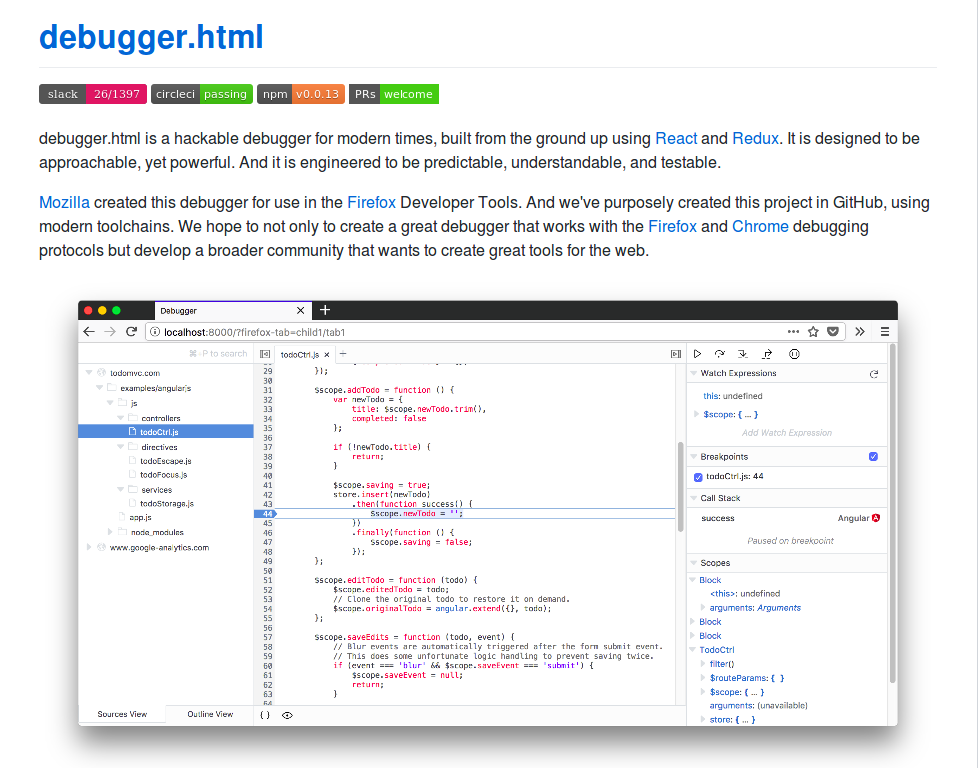

**“There are years that ask questions and years that answer.”**

I am fond of asking questions and used to ask many questions to myself as well as other people.

**My questions mostly revolves around :**

`How could I start contributing to open-source ?`

`I know these languages, are these enough for me ?`

`Am I ready to create hype in open-source ?`

`How to choose the project on GitHub that sounds interesting to me (because I don’t know where my interest actually lies) ?`

`What are the beginner-friendly communities?`

Whenever I used to meet new people on meetups, hackathon or conferences, my first question always revolve around these only. Sometimes I felt how stupid questions am asking, a feeling of inferiority, fear and hesitation got developed within me. I used to keep myself underrated. Moreover, once I got so frustrated, I just chucked my laptop.

##Happened with you, also?

We might think sometimes `I am unable to understand my own code, how am I supposed to read and then make changes to someone else’s code ?` Until last year, the same thing goes in my mind, too. Reading and understanding someone’s else code and writing your own code on top of that can be a daunting task, but with the right resources and guidelines, it is not as difficult as we might think.

Before stepping ahead into open-source, we should atleast know any programming language and have working knowledge of GitHub. Once you start making efforts, be more mindful to your activities, the more appreciation and results could be discovered. I don’t want to tire you people by telling the definition of open-source and all. Go-ahead and search by yourself 🙂

The first open-source project with which I started the contribution is [Debugger](https://github.com/firefox-devtools/debugger) from [Firefox Devtools](https://github.com/firefox-devtools)🔥🦊🛠

A brief explanation about project : [Debugger](https://github.com/firefox-devtools/debugger) is a hackable debugger for modern times, built from the ground up using `React` and `Redux`. It is designed to be approachable, yet powerful. And it is engineered to be predictable, understandable, and testable. Mozilla created this debugger for use in the Firefox Developer tools.

There’s ton of things that I like about the Mozilla Community. Being a beginner, we need proper guidance and help from the community on how to get involved and perform certain tasks, that could be best extracted from Mozilla. I felt the people in this community are not only contributing to the development of their own but others too.

For more detailed Information, visit the [site](https://github.com/firefox-devtools)

Debugger Project
 

If you need any help or want to ask any question, shoot mail at **soniasingla.1812@gmail.com** or [twitter](https://twitter.com/soniasinglas).

---
Best Wishes and Happy Coding 😉
---