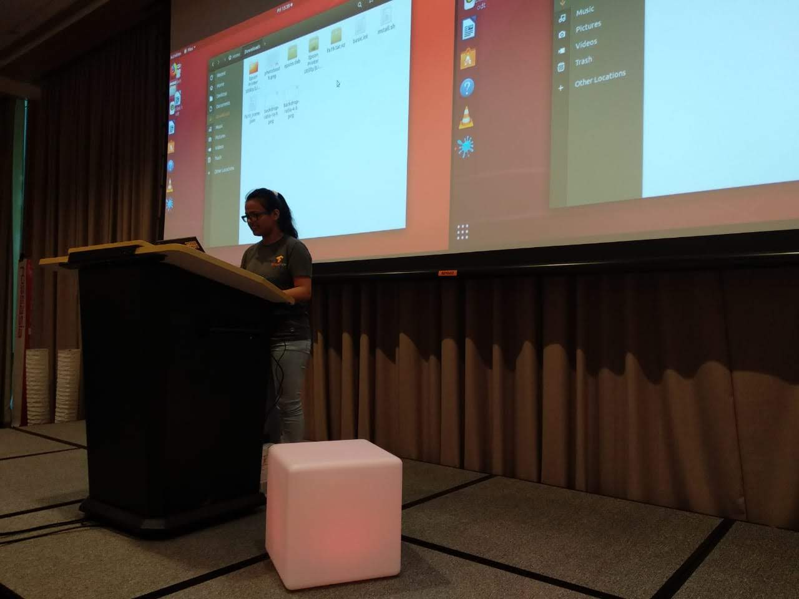

In this blog post, i want to share my experience and progress in the first half of my `Outreachy internship with Mozilla`. We are half way done ! But eh, I don’t want to end it, I am enjoying every part of this internship. In this, I am prototyping the next version of our in-browser reporting component in the form of web-extension.

With the help of my mentor, [Dennis](https://schub.wtf/), we divided the task into small steps : easy to manage, develop and gain clear understanding of the concepts involved with the coding side. On the start of this internship, I thought I’ll complete the basic prototyping till January but a lot has to be done and it will go long way. When we develop a new tool, write code for different functionalities, test them, handle the various scenarios involved, the formatting, it feels the tool will never be ready. It is bittersweet but when i look behind, it feels the sense of achievement.

I had weekly zoom meeting with my mentor and the [Webcompat](https://github.com/webcompat) team, where we focused and discussed to change the next steps a bit, re-prioritize the tasks, and make more progress on one task while cutting down on some things. During Christmas holidays, I spent most of time on researching and trying to implement advanced features that I could add to my extension tool. But that should be not be the initial task. It is important to learn how to re-prioritize the tasks otherwise you will be busy whole day but get nothing done.

Probably not as I planned or imagined, but it will work 😉

Currently, I am working on refactoring of code/writing more clean code : restructuring existing code, changing the factoring without changing it’s external behavior. It serves lot many advantages that include improved code readability, reduced complexity and source-code maintainability. Refactoring is a lot like solving a Rubik’s cube. There are lots of little steps required to achieve a large goal. Each step enables the next.

I code [@soniasingla](https://github.com/soniasingla/) and tweet at [@soniasinglas](https://twitter.com/soniasinglas)