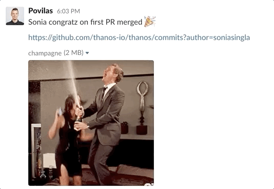

  

I can eat more 😹
 

I completed the second week of [my internship](https://soniasingla.com/cncf-intern-with-thanos/) at [Cloud Native Computing Foundation](https://www.cncf.io/) with [Thanos](https://people.communitybridge.org/project/f51284ab-f652-47b1-9819-cd4135e75c00) under the mentorship of [Bartek Plotka](https://www.bwplotka.dev/) and [Povilas Versockas](https://povilasv.me/) 🤗 💜

## WORK DONE :

It was again full week of learning new stuff. At the beginning of 2020, I wrote [my goals for this year](https://soniasingla.com/review-2019-goals-2020/), out of which getting healthier, taking care of my own self is one of the goal I want to achieve. For the major part of my day, I keep sitting on my chair, and even skip meals just because i don’t want to get out of it. I am happy to share that I am working on this and hopefully, this will go a long way 🏃🏻‍♀️

I had the weekly sync up meeting with my mentors, [Bartek Plotka](https://www.bwplotka.dev/) and [Povilas Versockas](https://povilasv.me/), where we discussed about the raw documentation I prepared on <i>**“Downsampling and unlimited metric retention”**</i> which was really vague. I spent most of my second week in reading Thanos documentation, blog posts, finding all possible user cases that are necessary for the tutorial. Get to know more about **[Thanos](https://thanos.io/)**, a set of components to make our Prometheus deployments a long-term TSDB solution with Highly Available setup. [Thanos](https://thanos.io/) has greatly enriched the metrics system, providing users with a single centralized query pane and a long term data storage, whilst making our Prometheus stack scalable and highly available! I am updating everything in GitHub as draft, you can view the pull request [here](https://github.com/thanos-io/thanos/pull/2757). Delivered 5 min short talk in our Mentees Hangout Meet, last Friday 😻💙. Apart from that, I got my first pull request merged 😍 (although, it was a small fix 😛).

  

Yeyyyyyyee🎉
 

I managed to send 3 pull requests this week, out of which I need to update the two pull requests 👩🏻‍💻. I am very good at breaking things ䷪

## PLANS FOR THE NEXT WEEK :

1. Work on the pending pull requests. I am making changes in accordance with mentor’s review, on a rolling basis.
2. Focus more on the tutorial work and additionally, convert the draft into more of a tutorial (send good wishes to me🤞🏻).

Before signing up, a huge shout to my co-mentees, [Harshitha Chowdary Thota](https://twitter.com/ThotaHarshitha), [Uche Obasi](https://twitter.com/Thisisobate), [Yash Sharma](https://twitter.com/yashrsharma44), [Prem Kumar](https://twitter.com/prmsrswt), for being so amazing and supportive ❤️🔥

**Signing off for today, until next week 👻**

**:wq**