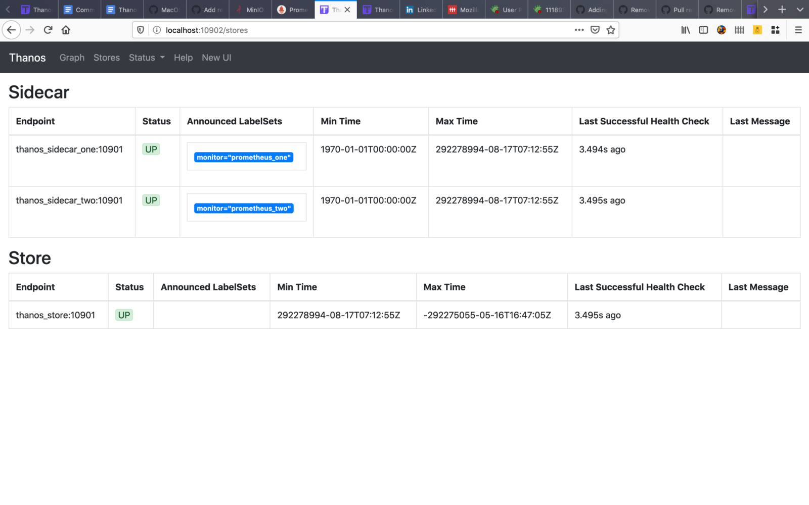

  

Excitement 😍
 

In this blog post, I want to share my experience and progress report of the last two weeks. The past two weeks were most exciting and challenging at the same time. We are half way done ! It feels like I began just yesterday. When busy, I do not notice how fast time flies. But eh, I don't want to end it, I am enjoying every part of this [internship](https://soniasingla.com/cncf-intern-with-thanos/) ❤️

## WORK DONE :

Follow up from the [previous](https://soniasingla.com/week2-community-bridge-progress-report/) blog, my 4 pull requests got merged 💃🏻 and 2 are still under process 🕗. It's an adventurous experience till now, and it's pretty cool seeing what is behind [Thanos](thanos.io), and the feeling of having some patches landed ⛴.

However, it's pretty challenging at the same time. No matter how experienced or novice a person is, everybody experiences struggle at some point in their journey. The statement seems pretty easy to admit for many people. But when you are a beginner stepping your foot in the mammoth field of software development, it's very difficult to acknowledge that even your mentors or other senior developers would have ever struggled at basic problems like you do. This gap in acknowledgement creates an inferiority complex and makes your journey to the top much more difficult than it should be.

To be specific talking about the issue, I was badly stuck on running Thanos store gateway. I spent one whole week, reading documentation, debugging, running, trying again but badly failed (fear of asking a stupid question kicked in 😅).

Finally, I gave up and discussed about this problem with my mentors, co-mentees and they helped me out of this. Thanks all who contributed their time and knowledge for helping me 🤗

  

Running Store Gateway locally
 

Coming to the tutorial **<i>"Downsampling and unlimited metric retention for Prometheus"</i>**, I'm adding multiple commits in single PR, you can subscribe to this [pull request](https://github.com/thanos-io/thanos/pull/2840) for all the updates. Please feel free to drop suggestions and review, let me know if something is missing 🤗

## PLANS FOR NEXT WEEK :

1. Add more commits to the tutorial **"Downsampling and unlimited metric retention for Prometheus"**
2. Work on the pending pull requests ⏳

**Signing off for today, until next week 👻**

**:wq**
