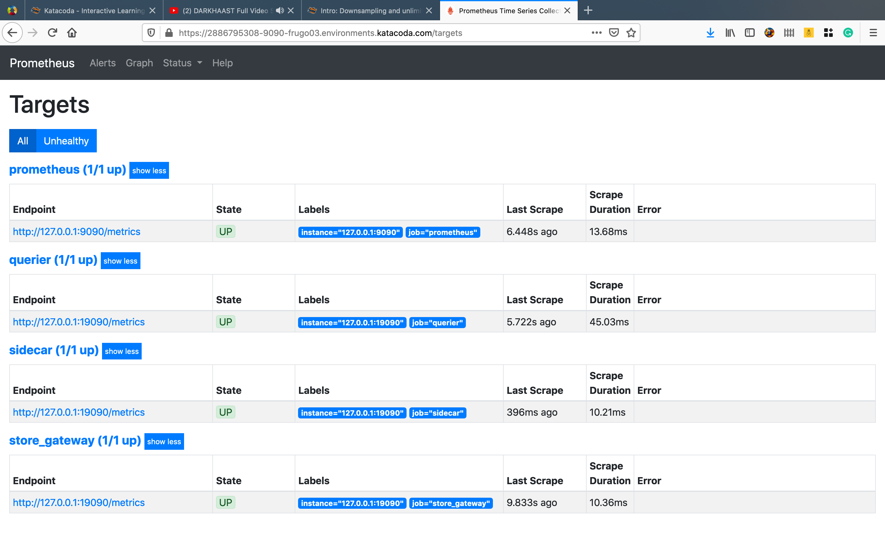

  

Thanos 🔥
 

I completed the six weeks of [my internship](https://soniasingla.com/cncf-intern-with-thanos/) at [Cloud Native Computing Foundation](https://www.cncf.io/) with [Thanos](https://people.communitybridge.org/project/f51284ab-f652-47b1-9819-cd4135e75c00) under the mentorship of [Bartek Plotka](https://www.bwplotka.dev/) and [Povilas Versockas](https://povilasv.me/) 🤗 ❤️

In this blog post, I want to share my experience and progress report of the last two weeks (i.e 5th and 6th week) 🤗.

## WORK DONE :

  

Targets
 

1. Completed the basic structure of the [tutorial](https://katacoda.com/soniasingla/courses/thanos/2-lts).
2. Delete unused code and dependencies from the [files](https://github.com/thanos-io/thanos/pull/2840/files).
3. Fixed container rendering bugs 🐞.
4. Improved the structure, content and design of the tutorial **"Downsampling and unlimited metric retention for Prometheus"**.

## PLANS FOR THE NEXT WEEK :

After 1:1 meeting with [Bartek Plotka](https://www.bwplotka.dev/) and [Povilas Versockas](https://povilasv.me/), we decided to re-structure the tutorial 🥱.

1. Convert 2 Prometheus servers into 1 Prometheus server, and similarly 1 Object Storage, 1 Thanos Store.
2. Add Thanos [Compactor](https://thanos.io/components/compact.md/) in the tutorial to show the retention capabilities 💪🏻.
3. Remove Downsampling from the tutorial 🤔.

As [Povilas](https://povilasv.me/) says **"Unorganized stuff is the best 😂, always make a mess and then try to make it look good"**.

Many excited things coming soon with the tutorial 😻

Stay Tuned 😉

**Signing off for today, until next week 👻**

**:wq**